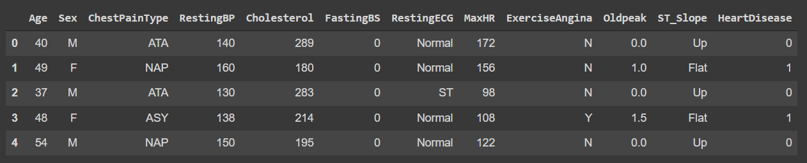
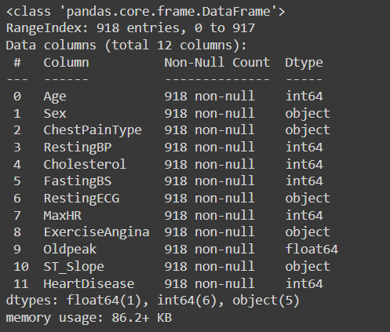

## Introduction
- This is project about creating self Logistic regression classifier using python and Comparing the performance with the model created using the inbuilt library scikit learn.

- The dataset for this project is "Heart Failure Prediction Dataset" downloaded from [Kaggle](https://www.kaggle.com/datasets/fedesoriano/heart-failure-prediction).

- The outflow of the project is as:

    a. Overview of the data 

    b. Visualization

    c. Data Processing

    d. Classifier Modeling

    e. Classifier using Scikit learn

    f. Comparison and conclusion

## Overview of the data 

```python
# Imporiting the required libraries

import numpy as np
import pandas as pd
import seaborn as sns
import matplotlib.pyplot as plt
from matplotlib import style
plt.style.use('dark_background')
import warnings
warnings.filterwarnings('ignore')

# Importing the data
df = pd.read_csv('heart.csv')

#The simple overview of the data is
df.head(5)
```


```python
#Getting a genera information about the features
df.info() 
```


**Observations**

	1. 918 samples with zero null 
	
	2. 11 features where 

		**One float** - ('Oldpeak')
		
		**Five  int** - ('Age', 'RestingBP', 'Cholesterol', 'FastingBS', 'MaxHR')
		
		**Five  Object** -  ('Sex', 'ChestPainType', 'RestingECG', 'ExerciseAgina')
		
Ok, so we have our features and their type. As there are no null value, we will check if Object features have any typo. We will also check if the float or float type features have any nan values. 

```python
#Categorical
features_cat = df.select_dtypes(include = ['object'])
for col in features_cat.columns:
  print(col, df[col].unique())
```
**Output**

*Sex ['M' 'F']*

*ChestPainType ['ATA' 'NAP' 'ASY' 'TA']*

*RestingECG ['Normal' 'ST' 'LVH']*

*ExerciseAngina ['N' 'Y']

ST_Slope ['Up' 'Flat' 'Down']*


Therefore, no typos.
```python
df.isna(),sum().sum()
```
**Output**
*0*
Therefore, no nan available.

Now we will see how many categorical variable are present in our dataset.
```python
#Checking if categorical
feature_num = df.select_dtypes(include = [np.number])
for col in feature_num.columns:
  print(col, len(df[col].unique()))
```
**Output**

**Output**

*Age 50*

*RestingBP 67*

*Cholesterol 222*

*FastingBS 2*


*MaxHR 119*

*Oldpeak 53*

*HeartDisease 2*


Looks like 'FasingBS' is also a categorical variable. Therefore, there are total 6 categorical variables (1 int and 5 objects.)


------
